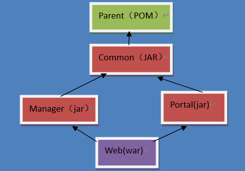
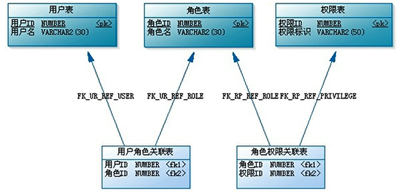
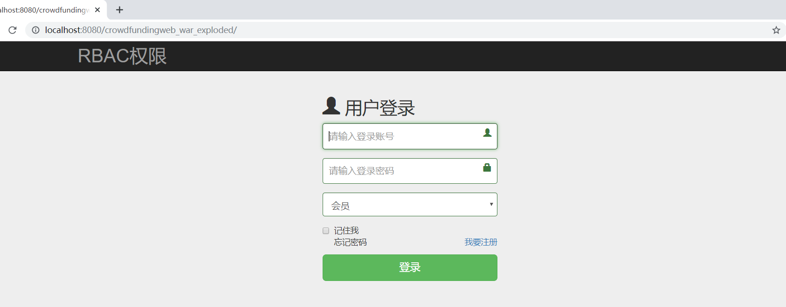
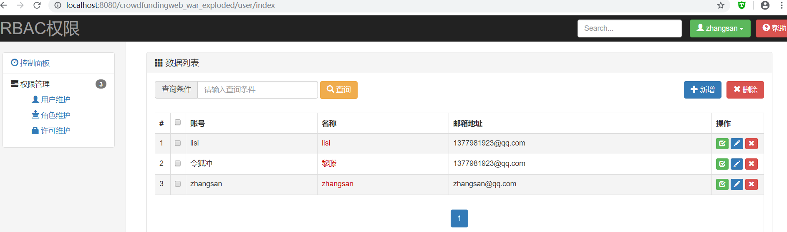
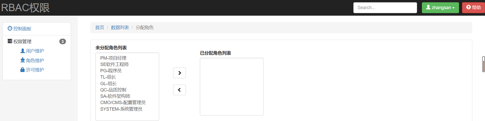
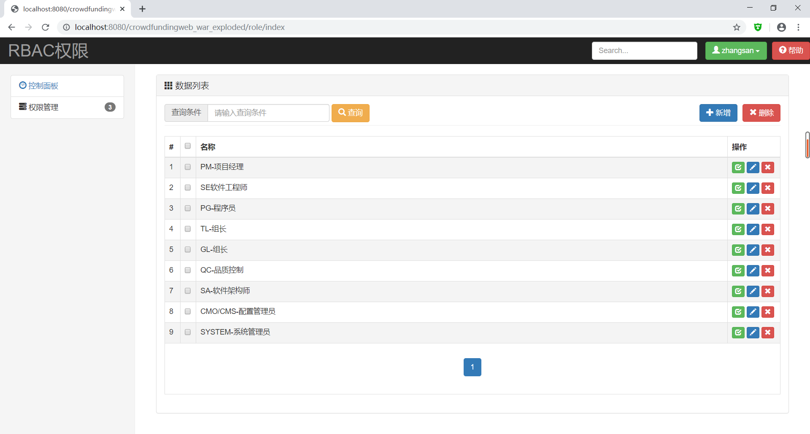
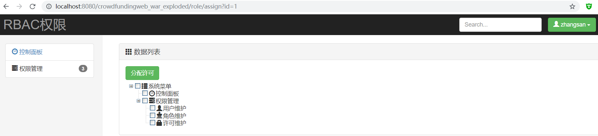
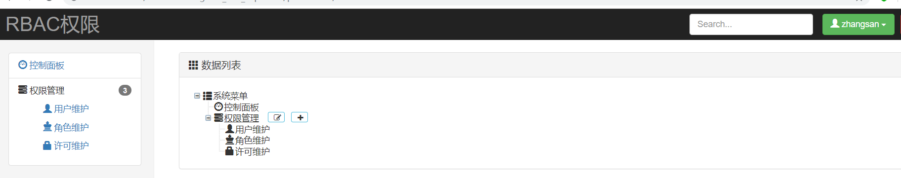

# RBAC权限

------------------------------------------------

> 一个简单的基于角色的权限访问控制的系统，包括了对用户的管理、对角色的管理、对权限的管理、以及对权限的分配等功能。

###  功能点

1. 分模块化的构建项目
3. 对用户、角色、权限的管理和分配
4. 对登陆和权限的拦截

### 技术点

1. 后端框架:**Spring**、**SpringMVC**、**Mybatis**
2. 数据库: **Mysql 8.0**
3. 前端框架:**BootStrap**、**jQuery**（**zTree**插件、**layer**插件）
4. 项目依赖管理：**Maven**


### 业务流程

1. 客户端发起请求
2. 过滤器处理编码问题
3. 前端控制器处理请求
4. 登陆拦截器判断是否登陆，权限拦截器判断是否具有权限
5. ``Controller``中的方法查询用户拥有的权限存入``session``
6. 视图解析器解析页面地址
7. 跳转到页面，根据用户的权限渲染页面元素


###  搭建项目

1. 项目结构的划分

   > [使用maven构建多模块web项目(IDEA)](https://blog.csdn.net/menglinjie/article/details/80745598)
   >
   > [maven的三种工程pom、jar、war](https://www.cnblogs.com/zhanghengscnc/p/8996843.html)
   
   + ``Portal``模块:前台门户相关(``jar``)
   + ``Common``模块:前台和后台共同项(``jar``)
   + ``Parent``模块:对所有的依赖关系进行管理(``pom``)
   + ``Web``模块:最终部署在服务器上(``war``)
   + `Manager`模块:后台管理相关(``jar``)
   
   
   
   
   
2. 框架的集成

   + 创建Maven Web项目

     + 在项目的pom.xml文件中增加依赖关系

   + 集成Spring框架

     > Spring框架是整个系统架构的核心，将前端请求数据的处理以及数据库的数据操作整合在一起，非常重要。

     1. 在``web.xml``文件中增加配置信息集成``Spring``框架

     ````xml
     <web-app>
     ...
         <context-param>
             <param-name>contextConfigLocation</param-name>
             <param-value>classpath*:spring/spring-*.xml</param-value>
         </context-param>
         <listener>
             <listener-class>org.springframework.web.context.ContextLoaderListener</listener-class>
         </listener>
     ...
     </web-app>
     ````

     ​	`Spring`环境构建时需要读取`web`应用的初始化参数`contextConfigLocation`, 从`classpath`中读取配置文件`spring/spring-*.xml`

     2. 在项目`src/main/resources/spring`目录中，增加`springmvc-context.xml`配置文件。

     ````xml
     <?xml version="1.0" encoding="UTF-8"?>
     <beans xmlns="http://www.springframework.org/schema/beans"
            xmlns:xsi="http://www.w3.org/2001/XMLSchema-instance"
            xmlns:context="http://www.springframework.org/schema/context" xmlns:tx="http://www.springframework.org/schema/tx">
     	...
     </beans>
     ````

     3. ``SpringMVC``框架的核心是处理数据的流转，所以需要在``springmvc-context.xml``配置文件中增加控制器对象（``Controller``）扫描的相关配置。扫描后由``SpringMVC``框架进行管理和组合。

     ````xml
     <context:component-scan base-package="com.lt.*">
         <!--排除Controller注解-->
         <context:exclude-filter type="annotation" expression="org.springframework.stereotype.Controller"/>
     </context:component-scan>
     ````

     > **扫描配置中为什么要排除Controller注解?**
     >
     > `Controller`注解的的作用是声明控制器（处理器）类。
     >
     > 从数据流转的角度，这个类应该是由`SpringMVC`框架进行管理和组织的，所以不需要由`Spring`框架扫描。
     
   + 集成SpringMVC框架
   
     > `SpringMVC`框架用于处理系统中数据的流转及控制操作。
     > （从哪里来，到哪里去。多么有哲理的一句话。）
   
     1. 集成``SpringMVC``框架，需要在``web.xml``文件中增加配置信息
   
     ````xml
     <servlet>
         <servlet-name>springmvc</servlet-name>
         <servlet-class>org.springframework.web.servlet.DispatcherServlet</servlet-class>
         <init-param>
             <param-name>contextConfigLocation</param-name>
             <param-value>classpath:spring/springmvc-context.xml</param-value>
         </init-param>
         <!--在服务器启动时创建并初始化-->
         <load-on-startup>1</load-on-startup>
     </servlet>
     
     <servlet-mapping>
         <servlet-name>springmvc</servlet-name>
         <url-pattern>/</url-pattern>
     </servlet-mapping>
     ````
   
     ​		`SpringMVC`环境构建时需要读取`servlet`初始化参数`init-param`, 从`classpath`中读取配置文件`spring/springmvc-context.xml`
   
     2. 在项目``src/main/resources/spring``目录中，增加``springmvc-context.xml``配置文件。
   
     ````xml
     <?xml version="1.0" encoding="UTF-8"?>
     <beans xmlns="http://www.springframework.org/schema/beans"
            xmlns:xsi="http://www.w3.org/2001/XMLSchema-instance"
            xmlns:context="http://www.springframework.org/schema/context" xmlns:tx="http://www.springframework.org/schema/tx">
     	...
     </beans>
     ````
   
     3. `SpringMVC`框架的核心是处理数据的流转，所以需要在`springmvc-context.xml`配置文件中增加控制器对象（`Controller`）扫描的相关配置。扫描后由`SpringMVC`框架进行管理和组合。
   
     ````xml
     <context:component-scan base-package="com.lt.*" use-default-filters="false" >
         <context:include-filter type="annotation" expression="org.springframework.stereotype.Controller"/>
     </context:component-scan>
     ````
   
     > **静态资源如何不被SpringMVC框架进行拦截?**
     > 在配置文件中增加``<mvc:default-servlet-handler/>, <mvc:annotation-driven />``即可
     >
     > 在实际的项目中静态资源不会和动态资源放在一起，也就意味着不会放置在服务器中，所以这些配置可以省略。
   
     4. 如果``SpringMVC``框架数据处理为页面跳转，那么需要配置相应的视图解析器``ViewResolver``。
   
     ````xml
     <bean class="org.springframework.web.servlet.view.InternalResourceViewResolver" >
         <property name="viewClass" value="org.springframework.web.servlet.view.JstlView"/>
         <property name="prefix" value="/WEB-INF/jsp/"/>
         <property name="suffix" value=".jsp"/>
     </bean>
     ````
   
     > **如果有多个视图解析器怎么办？**
     > ``SpringMVC``框架中允许存在多个视图解析器，框架会按照配置声明顺序，依次进行解析。
     >
     > ``SpringMVC``框架中配置多个视图解析器时，如果将``InternalResourceViewResolver``解析器配置在前，那么即使找不到视图，框架也不会继续解析，直接发生404错误，所以必须将``InternalResourceViewResolver``解析器放置在最后。
   
     5. 如果``SpringMVC``框架数据处理为响应``JSON``字符串，那么为了浏览器方便对响应的字符串进行处理，需要明确字符串的类型及编码方式。
   
        **如果增加了<mvc:annotation-driven />标签，下面的配置可省略。**
   
     ````xml
     <bean class="org.springframework.web.servlet.mvc.annotation.AnnotationMethodHandlerAdapter" >
         <property name="messageConverters" >
             <list>
                 <bean class="org.springframework.http.converter.json.MappingJacksonHttpMessageConverter" >
                     <property name="supportedMediaTypes" >
                         <list>
                             <value>application/json;charset=UTF-8</value>
                         </list>
                     </property>
                 </bean>
             </list>
         </property>
     </bean>
     ````
   
     6. 如果项目中含有文件上传业务，还需要增加文件上传解析器``MultipartResolver``
   
     ````xml
     <bean id="multipartResolver" class="org.springframework.web.multipart.commons.CommonsMultipartResolver" p:defaultEncoding="UTF-8" >
         <property name="maxUploadSize" value="2097152"/>
         <property name="resolveLazily" value="true"/>
     </bean>
     ````
   
   + 集成Mybatis框架
   
     > `Mybatis`框架主要处理业务和数据库之间的数据交互，所以创建对象和管理对象生命周期的职责可以委托`Spring`框架完成。
   
     1. 创建Mybatis核心对象
   
     ````xml
     <bean id="sqlSessionFactory" class="org.mybatis.spring.SqlSessionFactoryBean">
         <property name="configLocation" value="classpath:mybatis/config.xml"/>
         <property name="dataSource" ref="dataSource"/>
         <property name="mapperLocations">
             <list>
                 <value>classpath*:mybatis/mapper-*.xml</value>
             </list>
         </property>
     </bean>
     
     <bean id="mapperScannerConfigurer" class="org.mybatis.spring.mapper.MapperScannerConfigurer">
         <property name="basePackage" value="com.lt.crowdfunding.**.dao"/>
     </bean>
     ````
   
     2. 既然需要和数据库进行关联，那么`Mybatis`核心对象就需要依赖于数据库连接池（`C3P0`）,所以在`Spring`配置文件中增加相应的配置。
   
     ````xml
     <bean id="dataSource" class="com.mchange.v2.c3p0.ComboPooledDataSource">
         <property name="driverClass" value="com.mysql.cj.jdbc.Driver"/>
         <property name="jdbcUrl"
                   value="jdbc:mysql://localhost:3306/rbac?serverTimezone=GMT&amp;useSSL=false"/>
         <property name="user" value="root"/>
         <property name="password" value="lt123456"/>
     </bean>
     ````
   
     3. 增加核心配置文件`mybatis/config.xml`。
   
     ````xml
     <?xml version="1.0" encoding="UTF-8" ?>
     <!DOCTYPE configuration
             PUBLIC "-//mybatis.org//DTD Config 3.0//EN"
             "http://mybatis.org/dtd/mybatis-3-config.dtd">
     <configuration>
         <typeAliases>
     	...
         </typeAliases>
     </configuration>
     ````
   
     4. 增加`SQL`映射文件`mybatis/mapper-*.xml`
   
     ````xml
     <?xml version="1.0" encoding="UTF-8"?>
     <!DOCTYPE mapper PUBLIC "-//mybatis.org//DTD Mapper 3.0//EN" "http://mybatis.org/dtd/mybatis-3-mapper.dtd">
     <mapper namespace="com.lt.crowdfunding.dao.PermissionDao" >
     	...
     </mapper>
     ````
   
     5. 为了保证数据操作的一致性，必须在程序中增加事务处理。`Spring`框架采用声明式事务，通过`AOP`的方式将事务增加到业务中。所以需要在`Spring`配置文件中增加相关配置
   
     ````xml
     <bean id="transactionManager" class="org.springframework.jdbc.datasource.DataSourceTransactionManager">
         <property name="dataSource" ref="dataSource"/>
     </bean>
     <tx:advice id="transactionAdvice" transaction-manager="transactionManager">
         <tx:attributes>
             <tx:method name="*" propagation="REQUIRED" isolation="DEFAULT" rollback-for="java.lang.Exception"/>
             <tx:method name="query*" read-only="true"/>
         </tx:attributes>
     </tx:advice>
     <aop:config>
         <aop:advisor advice-ref="transactionAdvice" pointcut="execution(* com.lt..*Service.*(..))"/>
     </aop:config>
     ````


###  字符乱码问题

1. 解决字符乱码问题

   + 产生原因:浏览器使用``uutf-8``编码发送数据，而``tomcat``服务器默认使用``ISO-8859-1``解码。

   + 解决:

     + 自己在``Controller``的方法中转换编码,这样比较麻烦，``SpringMVC``给我们提供了字符编码过滤器

     ````java
     @RequestMapping("/doLogin")
     public String doLogin(User user, Model model) throws UnsupportedEncodingException { 
         //将乱码字符串按照错误的编码方式转换为原始的字符串序列
         byte[] bs=loginacct.getBytes("ISO8859-1");
     
         //将原始的字节码序列按照正确的编码转换为正确的文字即可
        loginacct=new String(bs,"UTF-8");
     }	
     ````

     + 在``web.xml``中配置字符编码过滤器，要配置在其他过滤器前面

     ````xml
     <filter>
         <filter-name>CharacterEncodingFilter</filter-name>
         <filter-class>org.springframework.web.filter.CharacterEncodingFilter</filter-class>
         <init-param>
             <param-name>encoding</param-name>
             <param-value>utf-8</param-value>
         </init-param>
         <init-param>
             <param-name>forceRequestEncoding</param-name>
             <param-value>true</param-value>
         </init-param>
         <init-param>
             <param-name>forceResponseEncoding</param-name>
             <param-value>true</param-value>
         </init-param>
     </filter>
     <filter-mapping>
         <filter-name>CharacterEncodingFilter</filter-name>
         <url-pattern>/*</url-pattern>
     </filter-mapping>
     ````


###  JSON字符串

> ``JSON（JavaScript Object Notation）``一种简单的数据格式，比``xml``更轻巧。``JSON``是``JavaScript``原生格式，这意味着在``JavaScript``中处理``JSON``数据不需要任何特殊的``API``或工具包。

1. ``JavaScript``语言

   + ``js``可以函数式编程，即一个方法就相当于``java``中创建对象
   + ``js``是动态语言，支持给对象动态添加属性

   ````html
   <script>
       function Student() {
           //this.sname = "zhangsan";
       }
       
       // JS支持给对象动态添加属性
       var s = new Student();
       s.sname = "lisi";
       alert(s);	//lisi
       
       var s1 = new Student();
       alert(s1);	//
   </script>
   ````

   ````html
   <script>
       // JSON : JavaScript Object Notation
       // 声明JSON普通对象
       var obj = {name:"lisi", age:20};
       obj.name = "zhangsan";
       alert(obj);
       
       //声明JSON集合对象
       var array = [{}, {}];
       alert(array.length);
       
       // JSON 字符串:将后台对象按照JSON格式转换为字符串输出到浏览器中，让JS当成对象来处理
   </script>
   ````

2. ·``JS``变量的作用范围

   ````html
   <script>
       // JS中使用var声明的变量就是局部变量
       // JS中不使用var声明的变量就是全局变量
       function test() {
           username = "zhangsan"; // 等同于window.username = "zhangsan"; 
       }
       
       test();
       
       alert(window.username);
       //document.getElementById("");
   </script>
   ````


###  RBAC权限模型

1. 概念

   + 权限管理，这是每个软件系统都会涉及到的，而且权限管理的需求本质往往都是一样，不同的角色拥有不同的权限，只要你充当了某个角色，你就拥有了相对应的功能。
   + `RBAC`（`Role-Based Access Control`，基于角色的访问控制），就是用户通过角色与权限进行关联。简单地说，一个用户拥有若干角色，每一个角色拥有若干权限。这样，就构造成**“用户-角色-权限”**的授权模型。在这种模型中，用户与角色之间，角色与权限（功能）之间，一般都是多对多的关系。

   

2. 项目应用

   + 本项目基于这个模型分别创建了5张数据库表
     + ``t_user``:用户表记录用户相关信息
     + ``t_role``:角色表记录角色相关信息
     + ``t_permission``：许可表记录许可信息
     + ``t_user_role``：记录用户和角色的关系
     + ``t_role_permission``：记录角色和许可的关系
     
     

###  查询用户权限时的几种方法递归与迭代

1. 直接读取树形结构数据，缺点数据写死

   ````java
   @ResponseBody
   @RequestMapping("/loadData")
   public Object loadData(){
       List<Permission> permissions=new ArrayList<Permission>();
   
       //方法一、读取树形结构数据
       //读取根节点
       Permission root=permissionService.queryRootPermission();
       //根据节点id获取子节点
       List<Permission> childPermissions=permissionService.queryChildPermissions(root.getId());
   
       //根据节点id获取子节点
       for (Permission childPermission:childPermissions){
           List<Permission> childChildPermissions=permissionService.queryChildPermissions(childPermission.getId());
           childPermission.setChildren(childChildPermissions);
       }
   
       root.setChildren(childPermissions);
       permissions.add(root);
   
       return permissions;
   }
   ````

2. 递归读取树形结构数据，缺点效率低

   ````java
   @ResponseBody
   @RequestMapping("/loadData")
   public Object loadData(){
       List<Permission> permissions=new ArrayList<Permission>();
       
      Permission parent=new Permission();
      parent.setId(0);
      queryChildPermissions(parent);
   
       return parent.getChildren;
   }
   
   /**
        * 递归查询许可信息
        * 1)方法自己调用自己
        * 2) 方法一定要存在跳出逻辑
        * 3)  方法调用时参数之间有规律
        * 4)  递归算法，效率比较低
        * @param parent
        */
   private void queryChildPermissions(Permission parent){
       List<Permission> childPermissions=permissionService.queryChildPermissions(parent.getId());
   
       for (Permission permission:childPermissions){
           queryChildPermissions(permission);
       }
       parent.setChildren(childPermissions);
   }
   ````

3. 嵌套for循环方式，使用了线性查找，效率比较低

   ````java
   @ResponseBody
   @RequestMapping("/loadData")
   public Object loadData(){
       List<Permission> permissions=new ArrayList<Permission>();
   
       //双重for循环查询许可信息
   	List<Permission> ps=permissionService.queryAll();
           for (Permission p:ps){
               //子节点
               Permission child=p;
               if (p.getPid()==0){
                   permissions.add(p);
               }else {
                   for (Permission innerPermission:ps){
                       if (child.getPid().equals(innerPermission.getId())){
                           //父节点
                           Permission parent=innerPermission;
                           //组合父子节点的关系
                           parent.getChildren().add(child);
                           break;
                       }
                   }
               }
           }
   
       return permissions;
   }
   ````

4. ``map``集合方式读取许可数据,

   ```java
   @ResponseBody
   @RequestMapping("/loadData")
   public Object loadData(){
       List<Permission> permissions=new ArrayList<Permission>();
   
       List<Permission> ps=permissionService.queryAll();
       Map<Integer,Permission> permissionMap=new HashMap<Integer, Permission>();
       for (Permission p:ps){
           permissionMap.put(p.getId(),p);
       }
   
       for (Permission p:ps){
           Permission child=p;
           if (p.getPid()==0){
               permissions.add(p);
           }else {
               Permission parent=permissionMap.get(child.getPid());
               //组合 父子节点的关系
               parent.getChildren().add(child);
           }
       }
   
       return permissions;
   }
   ```


###  登陆拦截器和权限拦截器

1. 登陆拦截器

   + 防止用户未登陆的情况下直接访问系统页面

   + 创建``LoginInterceptor.java``

     ````java
     //实现接口方式
     public class LoginInterceptor implements HandlerInterceptor {
     
         /**
          * 在控制器执行之前完成业务逻辑操作
          * @return方法的返回值决定逻辑是否继续执行，true表示继续执行，false表示不继续执行
          * @throws Exception
          */
         public boolean preHandle(HttpServletRequest httpServletRequest, HttpServletResponse httpServletResponse, Object o) throws Exception {
     
             //判断当前的用户是否已经登陆
             HttpSession session=httpServletRequest.getSession();
             User loginUser = (User) session.getAttribute("loginUser");
             String path=httpServletRequest.getSession().getServletContext().getContextPath();
     
             if (loginUser==null){
                 httpServletResponse.sendRedirect(path+"/login");
                 return false;
             }else {
                 return true;
             }
         }
     
         /**
          * 控制器执行完毕之后执行的逻辑操作
          */
         public void postHandle(HttpServletRequest httpServletRequest, HttpServletResponse httpServletResponse, Object o, ModelAndView modelAndView) throws Exception {
     
         }
     
         /**
          * 在完成视图渲染之后，执行此方法
          */
         public void afterCompletion(HttpServletRequest httpServletRequest, HttpServletResponse httpServletResponse, Object o, Exception e) throws Exception {
     
         }
     }
     
     ````

2. 权限拦截器

   + 防止用户访问更高级角色的权限

   + 创建``AuthInterceptor.java``

     ````java
     //继承父类方式实现
     public class AuthInterceptor extends HandlerInterceptorAdapter {
     
         @Autowired
         private PermissionService permissionService;
     
         @Override
         public boolean preHandle(HttpServletRequest request, HttpServletResponse response, Object handler) throws Exception {
             //获取用户的请求地址
             String uri=request.getRequestURI();
             String path=request.getSession().getServletContext().getContextPath();
     
             //判断当前的路径是否需要进行权限验证
             //查询所有需要验证的路径集合
             List<Permission> permissions=permissionService.queryAll();
             Set<String> uriSet=new HashSet<String>();
             for (Permission permission:permissions){
                 if (permission.getUrl()!=null||!"".equals(permission)){
                     uriSet.add(path+permission.getUrl());
                 }
             }
     
             if (uriSet.contains(uri)){
                 //权限验证
                 //判断当前用户是否拥有对应的权限
                 Set<String> authUriSet= (Set<String>) request.getSession().getAttribute("authUriSet");
                 if (authUriSet.contains(uri)){
                     return true;
                 }else {
                     response.sendRedirect(path+"/error");
                     return false;
                 }
             }else {
                 return true;
             }
         }
     }
     
     ````

3. 配置拦截器

   ````xml
   <?xml version="1.0" encoding="UTF-8"?>
   <beans xmlns="http://www.springframework.org/schema/beans"
          xmlns:xsi="http://www.w3.org/2001/XMLSchema-instance"
          xmlns:context="http://www.springframework.org/schema/context"
          xmlns:mvc="http://www.springframework.org/schema/mvc">
   	...
       <mvc:interceptors>
           <mvc:interceptor>
               <mvc:mapping path="/**"/>
               <mvc:exclude-mapping path="/login"/>
               <mvc:exclude-mapping path="/doAJAXLogin"/>
               <mvc:exclude-mapping path="/static/bootstrap/**"/>
               <mvc:exclude-mapping path="/static/css/**"/>
               <mvc:exclude-mapping path="/static/fonts/**"/>
               <mvc:exclude-mapping path="/static/img/**"/>
               <mvc:exclude-mapping path="/static/jquery/**"/>
               <mvc:exclude-mapping path="/static/layer/**"/>
               <mvc:exclude-mapping path="/static/script/**"/>
               <mvc:exclude-mapping path="/static/ztree/**"/>
               <bean class="com.lt.crowdfunding.web.LoginInterceptor"></bean>
           </mvc:interceptor>
           <mvc:interceptor>
               <mvc:mapping path="/**"/>
               <mvc:exclude-mapping path="/login"/>
               <mvc:exclude-mapping path="/doAJAXLogin"/>
               <mvc:exclude-mapping path="/static/bootstrap/**"/>
               <mvc:exclude-mapping path="/static/css/**"/>
               <mvc:exclude-mapping path="/static/fonts/**"/>
               <mvc:exclude-mapping path="/static/img/**"/>
               <mvc:exclude-mapping path="/static/jquery/**"/>
               <mvc:exclude-mapping path="/static/layer/**"/>
               <mvc:exclude-mapping path="/static/script/**"/>
               <mvc:exclude-mapping path="/static/ztree/**"/>
               <bean class="com.lt.crowdfunding.web.AuthInterceptor"></bean>
           </mvc:interceptor>
       </mvc:interceptors>
       ...
   </beans>
   ````


###  项目截图

1. 登陆页面

   

2. 用户维护

   

3. 角色分配

   

4. 角色维护

   

5. 权限分配

   

6. 许可维护

   